# 🐍 Python Data Structures and Algorithms (DSA) Labs

Welcome to the **Python Data Structures and Algorithms Labs**! This repository is a comprehensive, open-source library of fundamental programming concepts implemented from scratch in Python. Whether you are prepping for a **FAANG** interview or sharpening your problem-solving skills, this repo serves as your digital playground.

This repository contains **small, focused working code examples**, each living in its own folder, designed to:
- understand conceptual concept
- explore real-world use cases
- prepare for interviews
- learn problem-solving techniques
- understand complexity analysis


## 🎯 Purpose of Repo
The goal of this project is to bridge the gap between theoretical computer science and practical Python implementation. Unlike standard libraries, these scripts are written for **readability and educational clarity**, helping you understand the "why" behind every line of code.

> ⚠️ This repo is **not production-ready**. The goal is learning by building.

## 📚 What You Will Learn
By exploring this repository, you will master:
* 🛠 **Core Data Structures:** Linked Lists, Stacks, Queues, Trees, and Graphs.
* ⚡ **Algorithm Efficiency:** Understanding Big O Notation and time-space complexity.
* 🔍 **Search & Sort:** From Binary Search to QuickSort and MergeSort.
* 🧠 **Advanced Patterns:** Dynamic Programming, Greedy Algorithms, and Backtracking.
* 🐍 **Pythonic Best Practices:** Writing clean, PEP 8 compliant algorithmic code.


## 👥 Who Should Use This Repo
* **Students:** Complement your CS coursework with hands-on Python examples.
* **Job Seekers:** Technical interview preparation for LeetCode, HackerRank, and CodeSignal.
* **Self-Taught Devs:** Build a solid foundation in computational thinking.
* **Open Source Contributors:** Looking to refine implementations or add new algorithms.

## 🗺 Learning Roadmap
Follow this logical path to master DSA systematically:

```mermaid
flowchart TD

    A[Start DSA Preparation 🚀] --> B[Complexity Analysis ⏱️]
    B --> B1[Big-O Notation]
    B --> B2[Time vs Space Tradeoff]

    A --> C[Arrays & Strings 📦]
    C --> C1[Two Pointers]
    C --> C2[Sliding Window]
    C --> C3[Prefix Sum]

    A --> D[Recursion & Backtracking 🔁]
    D --> D1[Subsets]
    D --> D2[Permutations]
    D --> D3[Combination Problems]

    A --> E[Linked List 🔗]
    E --> E1[Fast & Slow Pointer]
    E --> E2[Cycle Detection]
    E --> E3[Reversal]

    A --> F[Stack & Queue 🥞]
    F --> F1[Monotonic Stack]
    F --> F2[LRU Cache]
    F --> F3[Deque Applications]

    A --> G[Binary Search 🔍]
    G --> G1[Search Space Reduction]
    G --> G2[Binary Search on Answer]

    A --> H[Hashing 🗂️]
    H --> H1[HashMap]
    H --> H2[Frequency Counting]
    H --> H3[Set Based Problems]

    A --> I[Trees 🌳]
    I --> I1[DFS]
    I --> I2[BFS]
    I --> I3[Binary Search Tree]
    I --> I4[Lowest Common Ancestor]

    A --> J[Heap / Priority Queue 🏔️]
    J --> J1[Top K Elements]
    J --> J2[Merge K Sorted Lists]

    A --> K[Graphs 🌐]
    K --> K1[BFS / DFS]
    K --> K2[Topological Sort]
    K --> K3[Dijkstra]
    K --> K4[Union Find]

    A --> L[Dynamic Programming 🧠]
    L --> L1[1D DP]
    L --> L2[2D DP]
    L --> L3[Knapsack]
    L --> L4[LIS]
    L --> L5[DP on Trees]

    A --> M[Greedy Algorithms 💡]
    M --> M1[Intervals]
    M --> M2[Activity Selection]

    A --> N[Bit Manipulation ⚡]
    N --> N1[XOR Tricks]
    N --> N2[Bit Masking]

    A --> O[Advanced Topics 🏆]
    O --> O1[Trie]
    O --> O2[Segment Tree]
    O --> O3[Fenwick Tree]

    style A fill:#ffcc00,stroke:#333,stroke-width:2px
```




## 📂 Repository Structure

```text
python-dsa-labs/
│
├── data-structures/
│   ├── arrays/
│   ├── linked-list/
│   ├── stack/
│   ├── queue/
│   ├── trees/
│   ├── graphs/
│   └── heap/
│
├── algorithms/
│   ├── sorting/
│   ├── searching/
│   ├── recursion/
│   ├── dynamic-programming/
│   └── greedy/
│
└── problems/
|   ├── easy/
|   ├── medium/
|   └── hard/
├── ...
├── .gitignore
├── LICENSE
└── README.md
```

**Each experiment:**
- is self-contained
- has its own dependencies
- can be run independently

## 🛠 Tech Stack
Common stack used across experiments:
- **Language:** Python 3.10+
- **Version Control** Git & GitHub
- **IDE:** VS Code (recommended)

## ⚙️ Environment Setup (One-Time)

### Step 1: Clone the Repository
```bash
git clone https://github.com/pankaj-kaushik/python-data-structures-algorithms.git
cd python-data-structures-algorithms
```
### Step 2: Create a Virtual Environment
```bash
python -m venv .venv
```
Activate it:

**Windows (PowerShell):**
```bash
.venv\Scripts\Activate.ps1
```

**Mac/Linux:**
```bash
source .venv/bin/activate
```

## ▶️ How to Run Example
Each example follows the same basic flow.

### Step 1: Move into the example folder
```bash
cd data-structures/<example-name>
```
### Step 2: Run the application
```bash
python filename.py
```
**📌 Always check the experiment’s README for exact commands.**

## 🧪 How to Add a New Example
Follow this standard structure:
```text
data-structures/
└── example-name/
    ├── filename.py
    ├── README.md 
```
Best practices:
- Focus on one concept
- Keep code minimal & readable
- Document:
  - what the experiment does
  - what you will learn
  - how to run it
  - edge cases

## 📚 Coding Format Followed:
Each implementation includes:
- Problem / Concept
- Approach Explanation
- Time Complexity
- Space Complexity
- Clean Python Implementation
**Example**
```text
Problem: Binary Search
Approach: Divide and conquer
Time Complexity: O(log n)
Space Complexity: O(1)
```

## ⚠️ Disclaimer
This repository is for **educational purposes only**. While these implementations are optimized for learning, they may not always be the most performant for production environments where Python's built-in libraries (like collections.deque or heapq) are preferred. Always analyze your specific use case!

## ⭐ Support

If you find this repository useful:
- Star ⭐ the repo
- Fork it
- Modify experiments
- Build your own labs

**Happy Coding 🧪🚀**
